# Using Domain Storytelling to Develop a Context Aware Framework to Support Interdisciplinary Scientific Inquiry in yt

- NCSA & iSchool at University of Illinois
- [yt-project.org](https://yt-project.org/)
- [data-exp-lab.github.io](https://data-exp-lab.github.io/)
- [github.com/yt-project](https://github.com/yt-project/)

---

#### Authors: Sam Walkow and Matthew Turk

---

## Why are we building software for interdisciplinary work?

There's a lot to choose from when it comes to scientific software.

Exponential growth in open source software has diversified the ecosystem but also narrowed the scope of the tools themselves. We see new domain specific tools emerge and existing tools start to stagnate, or disappear completely. Despite overlapping functionality and purpose, open source scientific libraries face difficulty attracting and keeping contributors for exiting tools. Additionally, these essential tools require substantial effort to learn and incorporate into a research workflow; this leads researchers to remain conservative, sticking to what they know. 

__Often, this means having to change the way we think__


In an effort to both harness and counter this exponential growth, the yt team is building a context aware framework using domain knowledge data gathered using a method called domain storytelling.


## What's yt?

### The Software

yt (https://yt-project.org/) is an open source python library designed for scientific analysis and visualization of volumetric data from the physical sciences. Historically yt was developed for computational astrophysics, but we aim to expand yt's capabilities to support: 

- __Geophysics__
- __Neuroimaging__
- __Weather__ 
- __Climate__
- __Oceanography__

Here's some yt examples:

---


</div>

<div class="col">


</div>

---

---

Supernova Ignition Simulation
https://arxiv.org/abs/1807.07579
(Evan O’Connor and Sean Couch, MSU)

</div>

<div class="col">

Predicted Weather Radar from Tornadogenesis Simulation<br/>
Leigh Orf (University of Wisconsin),<br/>
Image Credit: NCSA AVL

</div>

---

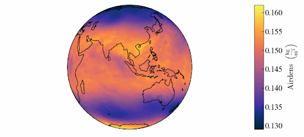

</div>
<div class="col">

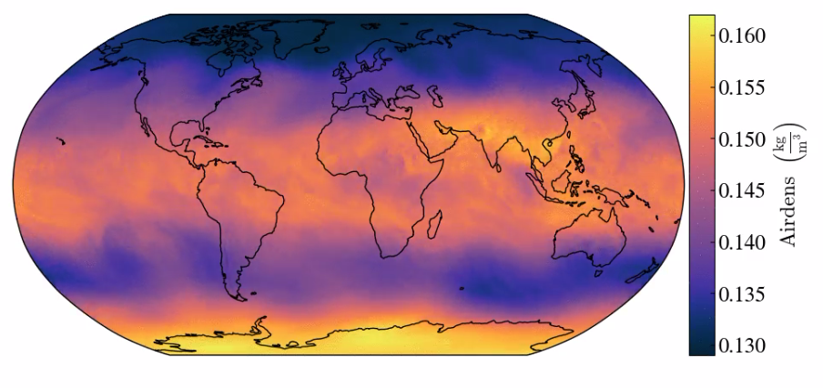

</div>

---

GEOS-5 Global Weather Model visualized with yt using map projections from Cartopy
Madicken Munk, (UIUC)

### The Community

We're also an active open source developer community, dedicated to consensus-oriented and code-driven discussions. We have about 162 contributors with over 27,000 commits mostly in python. 

The first commit was made in February 2007, and the last commit was made this week. 

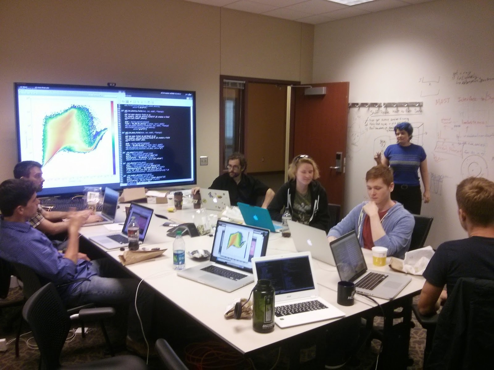


#### Join us on github: https://github.com/yt-project

## How are we going to develop our framework?

We want to address software sustainability and re-use issues by embedding user and domain context into software tools, and we are using yt as a testing platform. We are starting with the domain we know, astronomy, and will extend to other physical science domains.

### How can we bring together diverse and already tool-rich scientific areas? 

We believe that are a core set of operations that are used across physical science domains. Our goal is to create a new foundation in an already existing software by using common operations, rules and concepts shared across disciplines as the building blocks.

Operations of analysis and visualization are often re-used across domains, including:
- Loading and registering data into a coordinate system
- Methods of aggregation
- Methods of transformation
- Methods of plotting

By abstracting physical science analysis and visualization into a series of operations we can build a shared, robust framework that can be reconfigured and re-purposed across domains. 

#### What does this look like from a technical standpoint?

The yt team is implementing a context aware reference framework encoded into a JSON schema organized using natural science domain knowledge. The JSON schema is designed to be a fluid mental model within the software. We chose to use JSON to represent the framework because it allows for a declarative programming approach and is a tool agnostic format. This current project is working towards a method for capturing and encoding domain knowledge as it is relayed by domain experts. 


## Domain Stories

To build this schema, domain knowledge including jargon, data analysis tasks, and implicit rules are captured using domain storytelling; a technique that uses pictographs and use cases to illustrate a common workflow. 

For more information on this method: https://domainstorytelling.org/

A domain story is ‘told’ by having a domain scientist either describe or draw each step in their workflow, including interactions with their software tools, the data, and their internal thought process. We are collecting domain stories, or use cases, to capture two elements: high level workflow steps and underlying code examples to complete those steps. From these use cases, we are identifying data analysis patterns that can be described using a single vocabulary and set of rules, which can be implemented in python and yt. 

Starting with computational astrophysics domain we…
- Capture user workflow and thought process
- Identify key steps in analysis 
- Look for overlapping trends across stories
- Extract a common vocabulary and application of concepts
- Organize concepts in a computer readable and representation
- Mapping user stories to codebase


### A Domain Story about an Exploding Star

We started each story with general questions about the user workflow, with users drawing out their process. User's defined icons that indicated different features of their work - files, systems, operations, etc. They also indicated using arrows the order of actions and any steps they repeated. Often pseudocode was added to the drawing.

---

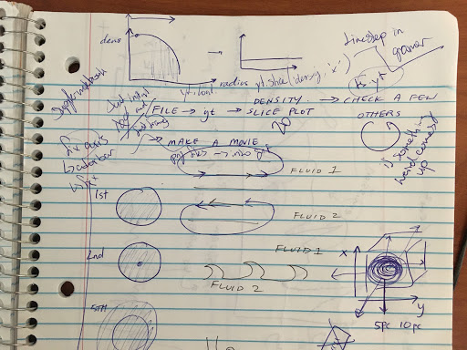

</div>

<div class="col">

- This domain story show the investigation of an exploding star
- The user manually creates multiple sliceplots across time steps to monitor changing density values
- In this process, the user iterates over the time steps as part of the exploration and saving the images that are rendered

</div>

---

- Users often started from the end and worked backward; they wanted to show what the process produced
- More detailed hand drawings showed the phenomena they were trying to understand
- Visualization was core to their internal understanding

</div>

<div class="col">

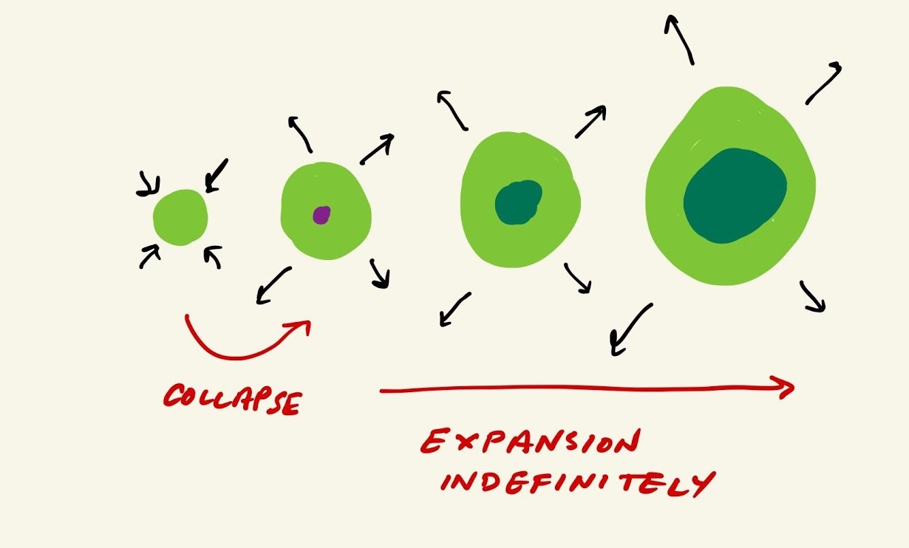

</div>

---


</div>

<div class="col">

- This is several sliceplots at different time points stitched together
- This user picked a part the data into slices, and then reconstructed them into an animation for better understanding
- Users also wanted to show their end product throughout the process

</div>

---

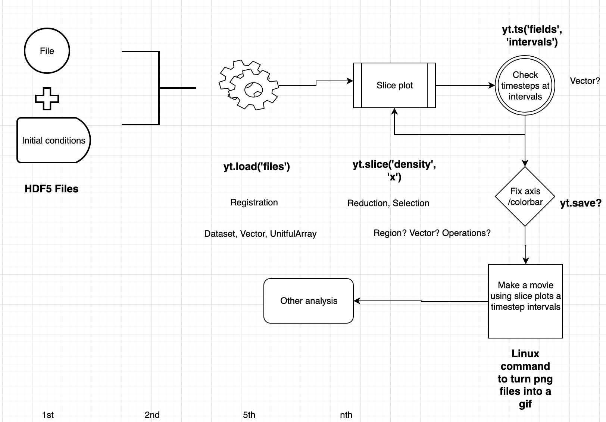

</div>

<div class="col">

- The domain story is formalized using icons and annotated with text and pseudocode
- We can see the shape and steps taken by the user, and where they iterate in their workflow
- We can start to categorize each action taken by the user to use across all stories

</div>

---

### A Domain Story about the Foramtion of the Moon

Not all users wanted to start by drawing. Some started by writing pseudocode instead. 

---

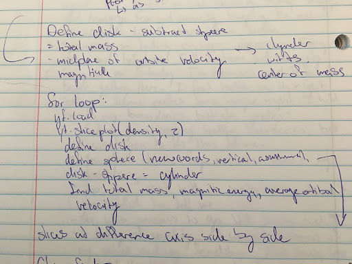

</div>

<div class="col">

- This domain story is about the formation of the moon
- The user is re-constructing the possible conditions for that formation to happen, and uses yt to create different shapes and data structures to test those conditions
- A for loop with pseudocode shows the high level process

</div>

---

- We used the pseudocode to create the domain story by ordering the pieces of code
- The user follow a pattern of loading data, exploring the data over many timesteps, and then beginning analysis. 
- yt served to guide data exploration, verify pieces that were later used for analysis, and to generate simulated physical structures

</div>

<div class="col">

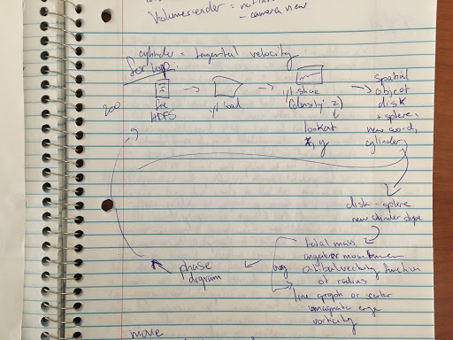

</div>

---

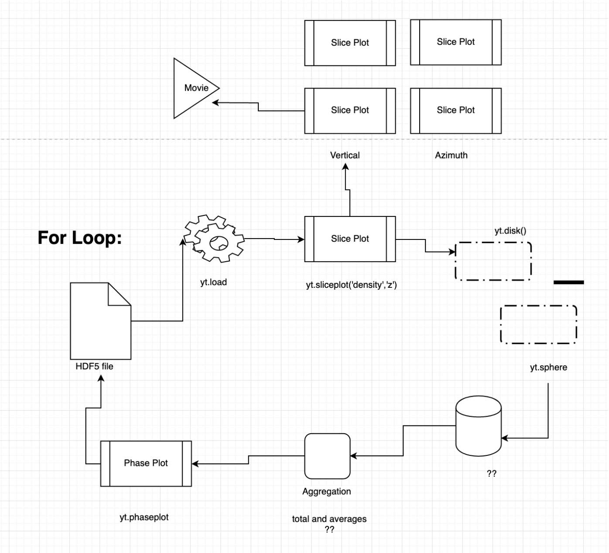

</div>

<div class="col">

- This story should one large workflow iterated over many times, with a few variations
- We can see a similar pattern of loading data, exploration using sliceplots and projection plots, and then building up structures in yt for analysis
- Keys pieces of analysis included methods of aggregation and correlation of values

</div>

---

### A Domain Story about Star Formation

For this domain story, also about star activity, the user had two distinct phases: exploration and analysis. While both previous stories had this as well, this story divides by completing one step before moving onto the next

---

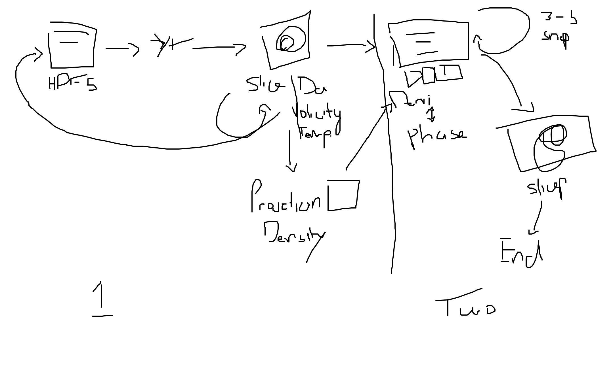

</div>

<div class="col">

- The user starts by looping all data to display a slice and projection plot to get an overview of the data and looks for trends
- The analysis phase is done at the cell level, as the user looks for correlating cells values across fields

</div>

---

- The user also stressed the importance of the physical nature of the dataset, and how that affected their mental model
- They start by looking the z axis, or the mid-plane of the data structure and look at the density values first
- This is where indicators of a trend could be found

</div>

<div class="col">

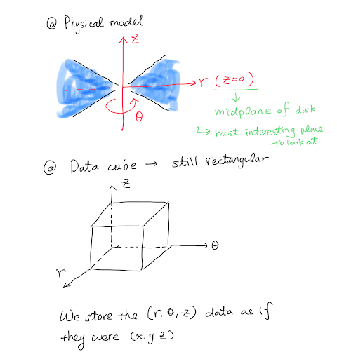

</div>

---

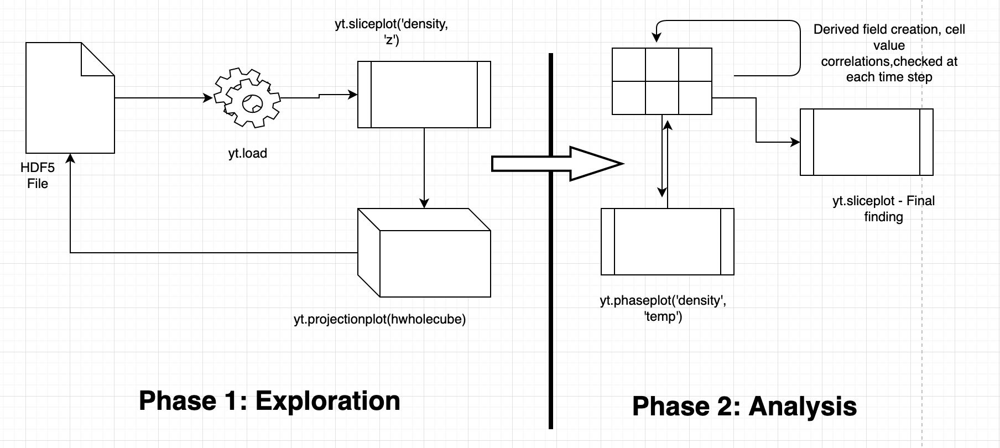

</div>

<div class="col">

Shared habits and starting points for investigation could inform default values for our schema, and how we can structure data so what users need is intuitive and easily accessible. 

</div>

---

## Descontructing the Narratives

These stories not only illustrate the complexity and order of the user workflow, but also shows how the user divides, repeats, and emphasizes certain steps in the computational process. 

---

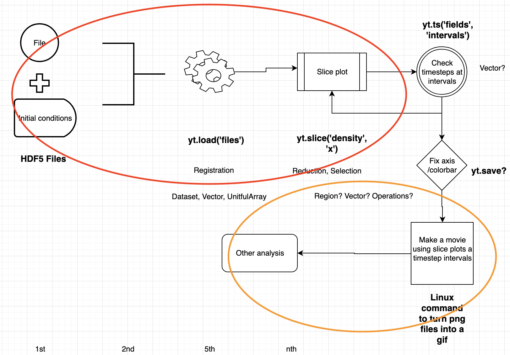

</div>
<div class="col">

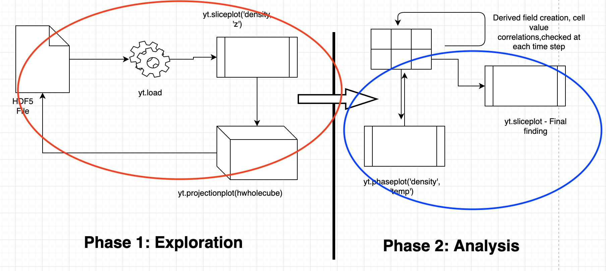

</div>

<div class="col">

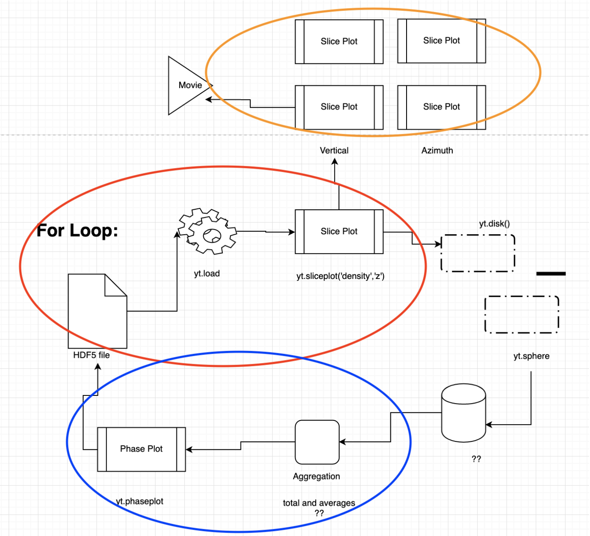

</div>

---

There a three common steps that were executed in exactly the same order and, more interestingly, for the same purpose:

#### <font color="red">1. First load data and create a sliceplot along the z axis (always this axis first) for density, and then for temperature. This is done to explore the raw data in context. Users emphasized the need to see the data in its shape to decide if values had significantly changed and therefore needed further investigation.</font>

#### <font color="orange"> 2. Create an animation from sliceplots. Users would cycle through hundreds sliceplots at various times steps either manually or in loops to look at the change in values over time. Once the sliceplots were created they stitched them together into a short movie they could watch back.</font>

#### <font color="blue"> 3. Use a Phaseplot for later analysis. To further investigate physical features, users would use a Phaseplot to look at correlations between fields along different axis.</font>

### All the users emphasized the ease of quickly create a sliceplot, projection plot, or phaseplot to both explore and analyze the data using yt. 

## Generating a JSON Schema

Now that we have some insight into user habits and mental models, we can start to take common user actions and convert them into a schema. Eventually, this schema will be what the user can program from declaratively. No knowledge of python would be needed, as users could start with the JSON as a template and simply specify what they would like the code to do. 

__Below, a simple yt script is taken and turned into a possible schema:__


```python
import analysis_schema
import yt
```

__Here we load an astronomy dataset using yt:__


```python
ds = yt.load("IsolatedGalaxy/galaxy0030/galaxy0030")
```

    yt : [INFO     ] 2020-06-26 13:11:15,215 Parameters: current_time              = 0.0060000200028298
    yt : [INFO     ] 2020-06-26 13:11:15,216 Parameters: domain_dimensions         = [32 32 32]
    yt : [INFO     ] 2020-06-26 13:11:15,217 Parameters: domain_left_edge          = [0. 0. 0.]
    yt : [INFO     ] 2020-06-26 13:11:15,217 Parameters: domain_right_edge         = [1. 1. 1.]
    yt : [INFO     ] 2020-06-26 13:11:15,218 Parameters: cosmological_simulation   = 0.0


__We create a sphere and specify the features and the units:__


```python
sp = ds.sphere("max", (10, 'kpc'))
```

    Parsing Hierarchy : 100%|██████████| 173/173 [00:00<00:00, 5799.40it/s]
    yt : [INFO     ] 2020-06-26 13:11:15,313 Gathering a field list (this may take a moment.)
    yt : [INFO     ] 2020-06-26 13:11:19,226 Max Value is 7.73427e-24 at 0.5040893554687501 0.4998168945312501 0.5001831054687500


__We can see yt shows us certain attributes of the sphere, and we can call on those attributes:__


```python
sp
```


    YTSphere (galaxy0030): , center=[1.55561975e+24 1.54243494e+24 1.54356506e+24] cm, radius=3.085677580962325e+22 cm


```python
list(sp.quantities.keys())
```


    ['WeightedAverageQuantity',
     'TotalQuantity',
     'TotalMass',
     'CenterOfMass',
     'BulkVelocity',
     'WeightedVariance',
     'AngularMomentumVector',
     'Extrema',
     'SampleAtMaxFieldValues',
     'MaxLocation',
     'SampleAtMinFieldValues',
     'MinLocation',
     'SpinParameter']


```python
sp.quantities.total_mass()
```


    unyt_array([3.27209035e+42, 8.58102338e+43], 'g')


__Here we a create JSON object that represents a sphere:__


```python
schema_sphere = analysis_schema.Sphere(center= analysis_schema.UnitfulCoordinate(unit="unitary",
                                                                                 values =[0.5, 0.5, 0.5]), 
                                       radius=analysis_schema.UnitfulValue(unit="kpc", value=50))
```


```python
schema_sphere
```


    Sphere(center=UnitfulCoordinate(values=[0.5, 0.5, 0.5], unit='unitary'), radius=UnitfulValue(value=50.0, unit='kpc'))


```python
schema_sphere.json()
```


    '{"center": {"values": [0.5, 0.5, 0.5], "unit": "unitary"}, "radius": {"value": 50.0, "unit": "kpc"}}'


__We can also see the schema that was used to create the object:__


```python
print(schema_sphere.schema_json(indent=2))
```

    {
      "title": "Sphere",
      "type": "object",
      "properties": {
        "center": {
          "$ref": "#/definitions/UnitfulCoordinate"
        },
        "radius": {
          "$ref": "#/definitions/UnitfulValue"
        }
      },
      "required": [
        "center",
        "radius"
      ],
      "definitions": {
        "UnitfulCoordinate": {
          "title": "UnitfulCoordinate",
          "type": "object",
          "properties": {
            "values": {
              "title": "Values",
              "default": [
                0.5,
                0.5,
                0.5
              ],
              "minItems": 3,
              "maxItems": 3,
              "type": "array",
              "items": {
                "type": "number"
              }
            },
            "unit": {
              "title": "Unit",
              "default": "unitary",
              "type": "string"
            }
          }
        },
        "UnitfulValue": {
          "title": "UnitfulValue",
          "type": "object",
          "properties": {
            "value": {
              "title": "Value",
              "type": "number"
            },
            "unit": {
              "title": "Unit",
              "default": "unitary",
              "type": "string"
            }
          },
          "required": [
            "value"
          ]
        }
      }
    }


## Future Directions

This is the first step to investigating the mental model and code objects, attributes and inter-relationships that are shared across natural science domains including oceanography, climate and weather, neuroscience and geophysics. The JSON schema will be extended across domains and can be implemented in existing science software tools to support interdisciplinary lines of scientific inquiry with a dynamic and context driven framework. As we investigate how best to capture and encode domain expertise, we hope this work will be a model for future open source development and create a novel avenue for dynamic, and domain agnostic tooling.

## About the Authors

#### Sam Walkow, Informatics PhD Student at the University of Illinois

Sam Walkow is a PhD student in Informatics interested in open source software sustainability and culture and data visualization. She's investigating these issues by looking at the intersection of human and computer workflows, problem solving and data conception and representation. 

#### Contact:
- @samwalkow (twitter)
- swalkow2@illinois.edu


#### Matthew Turk, Assistant Professor in School of Information Sciences at the University of Illinois

Matthew Turk is an assistant professor in the School of Information Sciences and also holds an appointment with the Department of Astronomy in the College of Liberal Arts and Sciences. His research is focused on how individuals interact with data and how that data is processed and understood.

At the University of Illinois, he leads the Data Exploration Lab and teaches in Data Visualization, Data Storytelling, and Computational Astrophysics.


#### Contact:

[Matthew Turk dot github dot io](https://matthewturk.github.io/)

## Acknowledgements

We would like to thank major yt contributors including Nathan Goldbaum, and the larger yt community for their sustained effort. 

We would also like to thank the following entities for their support:

- The Gordon and Betty Moore Foundation’s Data-Driven Discovery Initiative through Grant GBMF4561.
- The National Science Foundation under Grants OAC-1663914 and ACI-1535651
- NumFOCUS
